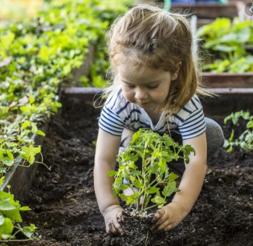

## DIP_LAB_WORKS
**1. Develop a program to display grayscale image using read and write operation.**
```python
import cv2
#Gray scale Img
gray_img=cv2.imread(r'Methi.jpg',0)
cv2.imshow('Gray_Img',gray_img,)
cv2.waitKey(0)
cv2.destroyAllWindows()
```
***output:***

---
